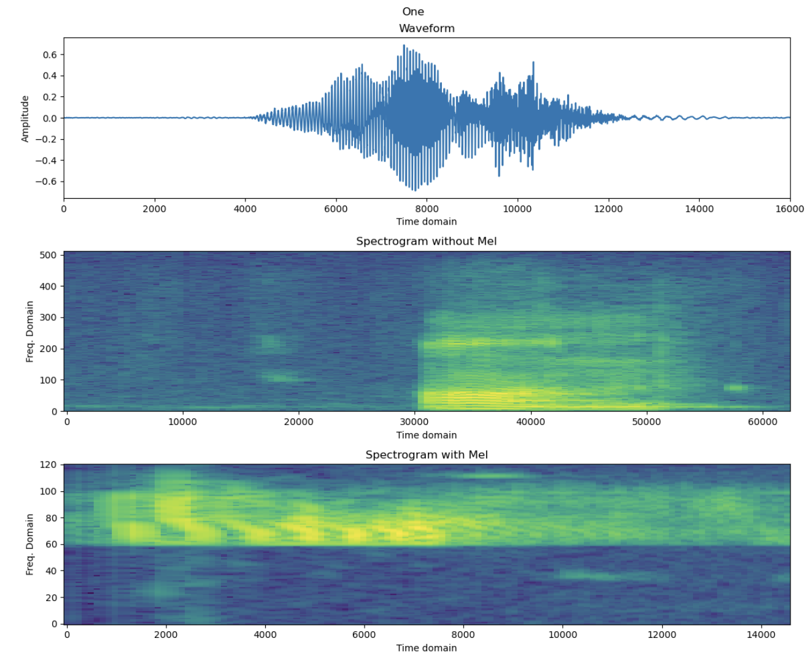
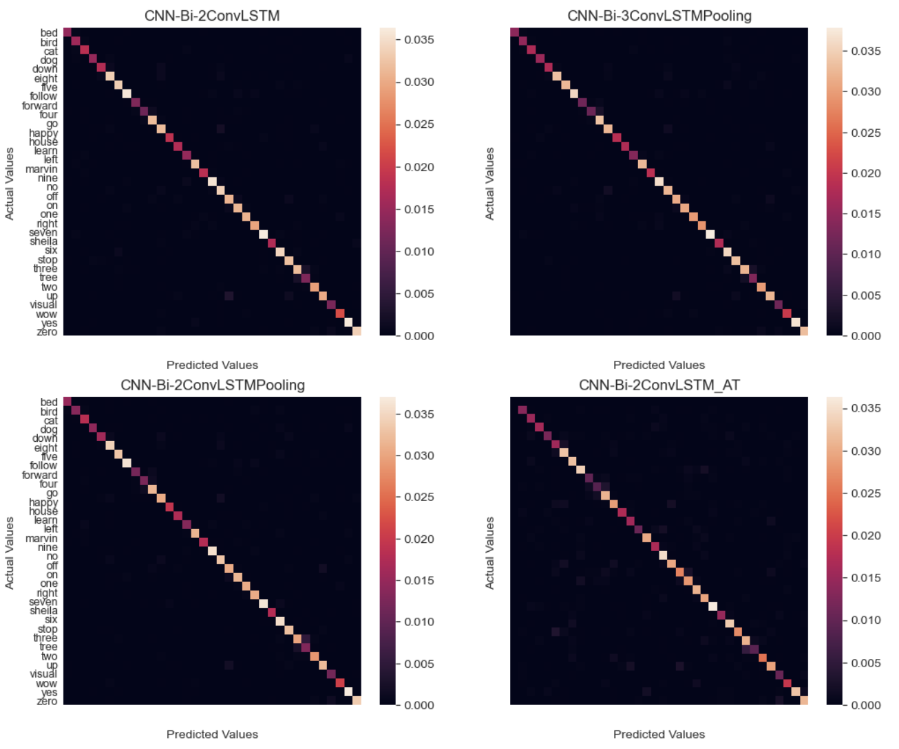

# Evaluation of different NN architectures for Speech recognition task with speech_command dataset of Tensorflow

<object data="https://github.com/maxhoeth/speech-recognition/blob/main/pdf/speech_recognition.pdf" type="pdf" width="700px" height="700px">
    <embed src="https://github.com/maxhoeth/speech-recognition/blob/main/pdf/speech_recognition.pdf">
        
Paper of the project: <a href="https://github.com/maxhoeth/speech-recognition/blob/main/pdf/speech_recognition.pdf">Download PDF</a>.

    </embed>
</object>

